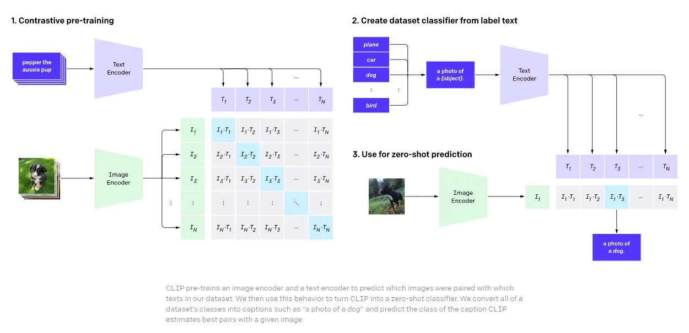

# CLIP Model for Text-Image Similarity
This repository contains the implementation of a CLIP (Contrastive Language-Image Pre-training) model for calculating similarity between text and images. 
CLIP is a powerful model that learns to understand images and text in a joint embedding space, allowing for cross-modal similarity comparisons.

## CLIP (Contrastive Language-Image Pre-training):
This repository provides an interface for utilizing the pre-trained CLIP model to measure the similarity between textual queries and images.
CLIP, developed by OpenAI, is a groundbreaking vision-language model designed for understanding and reasoning across different modalities, namely text and images. 
Unlike traditional methods that treat vision and language separately, CLIP learns a unified embedding space where images and text share a common representation. 
This allows the model to seamlessly bridge the semantic gap between images and their associated textual descriptions. The innovation of the model is contrastive training approach,
where positive (image, text pair) and negative (other images, and text) samples are employed to learn a scoring function in-order to obtain a representation of the data. 
 
<p align="center"></p>

Overall, CLIP's **multimodal capabilities**, **pre-trained representations**, and **versatility in handling diverse tasks** make it an excellent choice as a similarity metric for text-image relationships. 
Its inherent ability to bridge the gap between vision and language aligns well with the requirements of tasks involving cross-modal understanding and similarity measurements.

## Implementation detail

### packages and liberies
Please refer to the requirements.txt file for the necessary dependencies and installation instructions.
```bash
pip install -r requirements.txt
```
The **transformers** library is incorporated, borrowed and installed from Hugging Face. Additionally, the **memory_profiler** tool is employed to assess the code's memory footprint.
### Device
This experiment utilizes an **NVIDIA RTX A2000 Laptop GPU (4G)** card for accelerated processing.

### Model
We use pretrained **"openai/clip-vit-base-patch32"** CLIP model. The model uses a ViT-B/32 Transformer architecture as an image encoder and uses a masked self-attention Transformer as a text encoder.
These encoders are trained to maximize the similarity of (image, text) pairs via a contrastive loss. However, other pretrained CLIP models are also applicable (e.g. "laion/CLIP-ViT-g-14-laion2B-s12B-b42K", "openai/clip-vit-large-patch14", "openai/clip-vit-large-patch14-336") by modifying the config file.

### Config file
A configuration file (`config.yaml`) is included to adjust code parameters:

```yaml
csv_path: "./challenge_set/challenge_set.csv"  # Path to the CSV file containing image URLs and captions
image_path: "url"  # Option to retrieve images from the network using provided URLs or read from the local drive
use_cuda: true  # Option to use GPU
pretrained_model: "openai/clip-vit-base-patch32"  # Pretrained CLIP model; can be set to other options as well
```

## Time and memory footprint of computing the similarity metric (CLIP)


| Class | Name |
| ------| -----|
| 0   | Neither roof or solar|
| 1   | roof   |
| 2   | solar   |
| 3   | roof/solar   |
| 4   | unknown   |

- To construct the train, validation, and test sets, the patches extracted from the input pairs of image and mask are split into three sets using probabilities of 0.7, 0.2, and 0.1, respectively. 
The number of patches allocated to each set is determined as:  

| train | validation | test| TOTAL |
| ------| ------|------|------|
| 28876 | 5565| 2872| 37313|

## Usage

