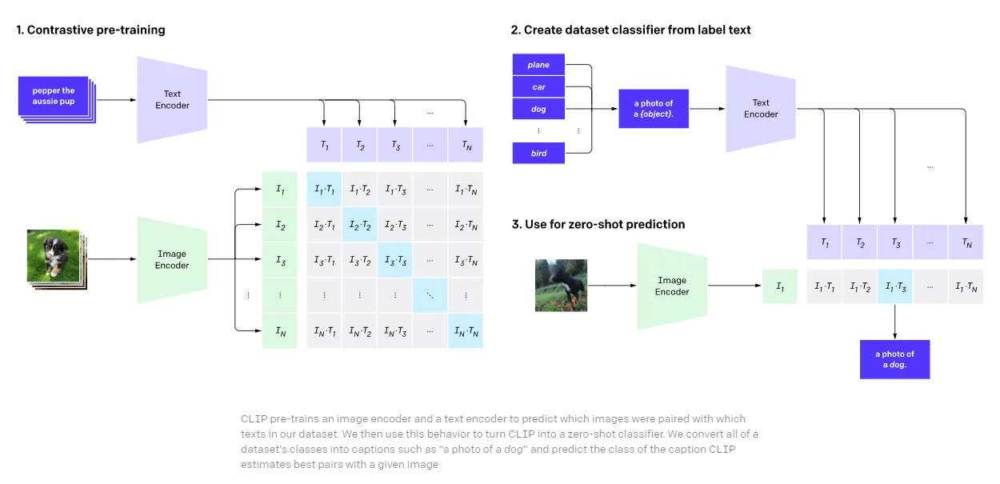
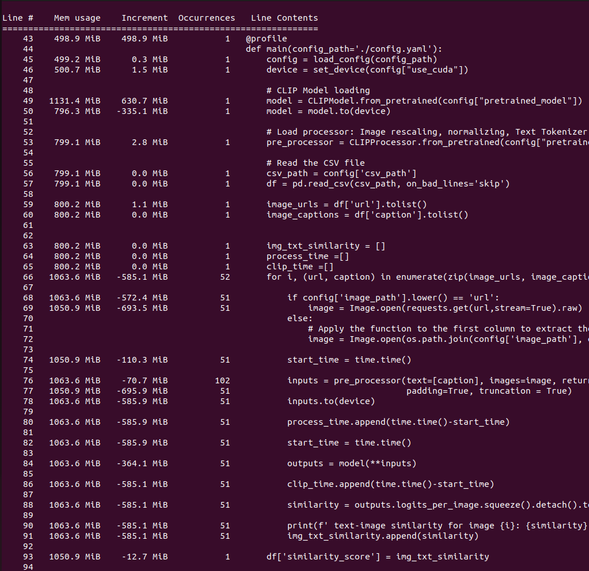
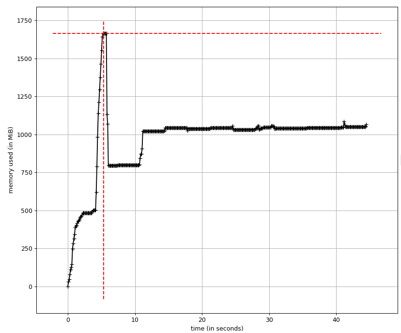
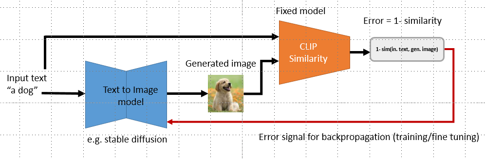

# CLIP Model for Text-Image Similarity
This repository contains the implementation of a CLIP (Contrastive Language-Image Pre-training) model for calculating the similarity between text and images. 
CLIP is a powerful model that learns to understand images and text in a joint embedding space, allowing for cross-modal similarity comparisons.

## CLIP (Contrastive Language-Image Pre-training):
This repository provides an interface for utilizing the pre-trained CLIP model to measure the similarity between textual queries and images.
CLIP, developed by OpenAI, is a groundbreaking vision-language model designed for understanding and reasoning across different modalities, namely text and images. 
Unlike traditional methods that treat vision and language separately, CLIP learns a unified embedding space where images and text share a common representation. 
This allows the model to seamlessly bridge the semantic gap between images and their associated textual descriptions. The innovation of the model is a contrastive training approach,
where positive (image, text pair) and negative (other images, and text) samples are employed to learn a scoring function in order to obtain a representation of the data. 
 
<p align="center"></p>

Overall, CLIP's **multimodal capabilities**, **pre-trained representations**, and **versatility in handling diverse tasks** make it an excellent choice as a similarity metric for text-image relationships. 
Its inherent ability to bridge the gap between vision and language aligns well with the requirements of tasks involving cross-modal understanding and similarity measurements.

## Implementation detail

### packages and liberies
Please refer to the requirements.txt file for the necessary dependencies and installation instructions.
```bash
pip install -r requirements.txt
```
The **transformers** library is incorporated, borrowed and installed from Hugging Face. Additionally, the **memory_profiler** tool is employed to assess the code's memory footprint.
### Device
This experiment utilizes an **NVIDIA RTX A2000 Laptop GPU (4G)** card for accelerated processing. All time and memory footprints are specific to this computational resource.

### Model
We use pretrained **"openai/clip-vit-base-patch32"** CLIP model. The model uses a ViT-B/32 Transformer architecture as an image encoder and uses a masked self-attention Transformer as a text encoder.
These encoders are trained to maximize the similarity of (image, text) pairs via a contrastive loss. However, other pretrained CLIP models are also applicable (e.g. "laion/CLIP-ViT-g-14-laion2B-s12B-b42K", "openai/clip-vit-large-patch14", "openai/clip-vit-large-patch14-336") by modifying the config file. Besides CLIP variants, alternative methods such as **SigLIP** (Sigmoid Loss for Language Image Pre-Training, e.g. "google/siglip-base-patch16-224") are viable options. The key difference lies in the training loss; SigLIP doesn't necessitate a global view of all pairwise similarities of images and texts within a batch. Instead, unlike the softmax used in CLIP, it applies the sigmoid activation function to logits.
### Config file
A configuration file (`config.yaml`) is included to adjust code parameters:

```yaml
csv_path: "./challenge_set/challenge_set.csv"  # Path to the CSV file containing image URLs and captions
image_path: "./challenge_set/" ## "url"  # Option to retrieve images from the network using provided URLs or read from the local drive
use_cuda: true  # Option to use GPU
pretrained_model: "openai/clip-vit-base-patch32"  # Pretrained CLIP model; can be set to other options as well
```
**Note:** Due to network latency when reading images from the provided URLs, all results are based on reading from the local drive (i.e. image_path: "./challenge_set/").
### Run
```bash
python image_text_sim_clip.py --config "path-to-config-file"
```
## Q2 (a): Time and memory footprint of computing the similarity metric (CLIP)
Efficient memory usage and rapid inference speed position the CLIP model as a favourable and effective choice for measuring image-text similarity.
### Time/GPU
As the primary components of the code involve pre-processing and computing CLIP metric values, we present the average time taken for these two sections along with GPU memory consumption. (The average is calculated over all image-text pairs).
| Part | Time per (image, text) | GPU per (image, text)|
| ------| -----|---------
| Avg Time taken for pre-processing (image scaling, tokenizer) | 0.0518 sec|---|
|  Avg Time taken for CLIP metric   | 0.0471 sec   |---|
| -----------------|-------------------|---|
| **Total**   | 0.0988~0.1sec   | 860 MB|

### Memory consumtion
The figures below depict the main function's line-by-line and temporal memory (RAM) footprints. The peak memory usage for this experiment is 1658MB. 
<p align="center">
  
  
</p>

## Q2 (b): Scaling up
Given the existing configuration (code and hardware), the anticipated duration (days) for processing 100 million image-text pairs is as follows:


$$
\frac{100,000,000 \times 0.1}{60 \times 60 \times 24} = 115.74
$$


To scale up the code for processing approximately ~100 million text-image pairs, the following improvements can be considered:
1. **Batch processing**: Simultaneously processing multiple image-text pairs in batches can significantly enhance the overall processing speed and reduce the overhead associated with individual predictions.
- Considering the current GPU card capacity (4GB) and GPU usage (860MB per image-text), utilizing a batch size of 4 is expected to yield a 4x increase in processing speed compared to the current experiment.
2. **Parallelization/ Cloud computing**: Leveraging distributed processing across ample GPU clusters. HuggingFace's "Accelerate" library would be a fine tool for this purpose.
3. **Quantization**: Explore quantization techniques to represent embeddings with fewer bits, further reducing computation and memory footprint.
4. **Data Partitioning**: Split the dataset into smaller chunks and process them independently, then aggregate the results.

## Q3: Curate data for text-to-image model training
We can use the CLIP metric to calculate the dissimilarity (1-similarity) between the provided input text and the generated image. The computed dissimilarity (error) can then be employed for training/fine-tuning a text-to-image model. Specifically, the following pipeline can be employed to supervise the training of a text-to-image model (e.g., stable diffusion): 
<p align="center"></p>
